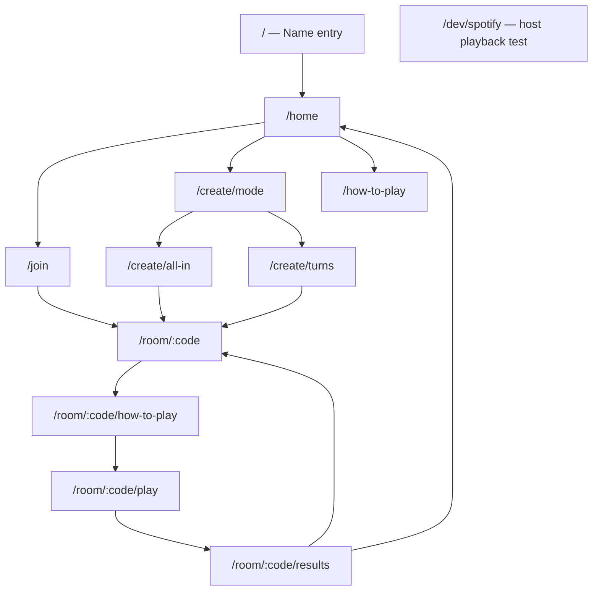
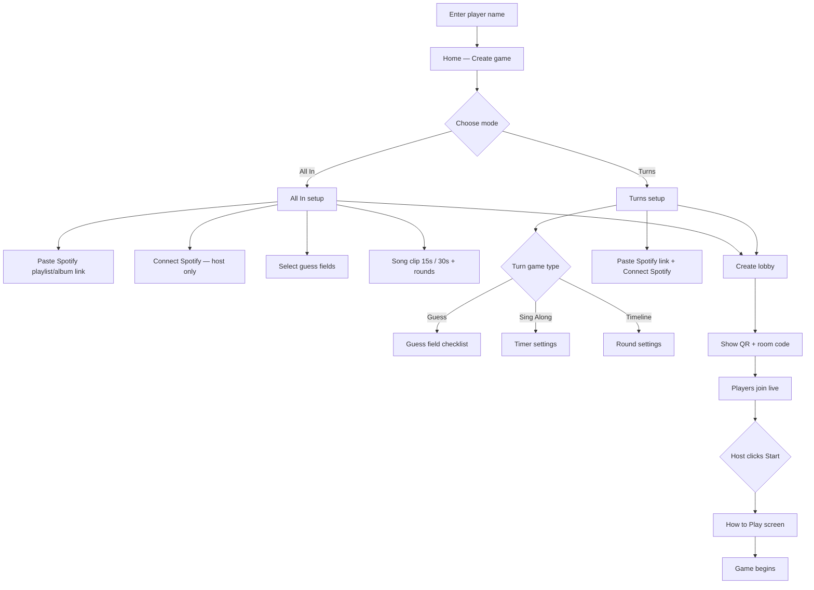
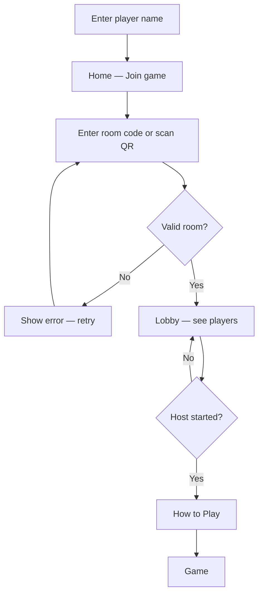
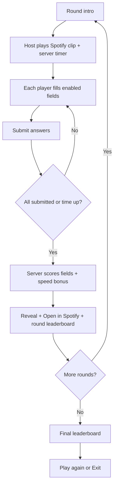
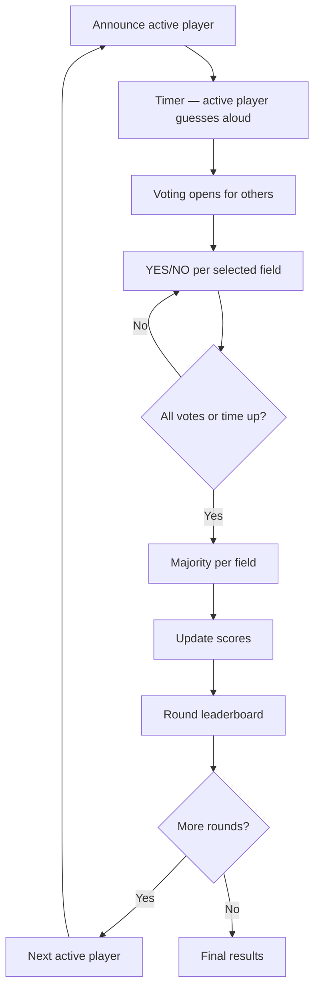
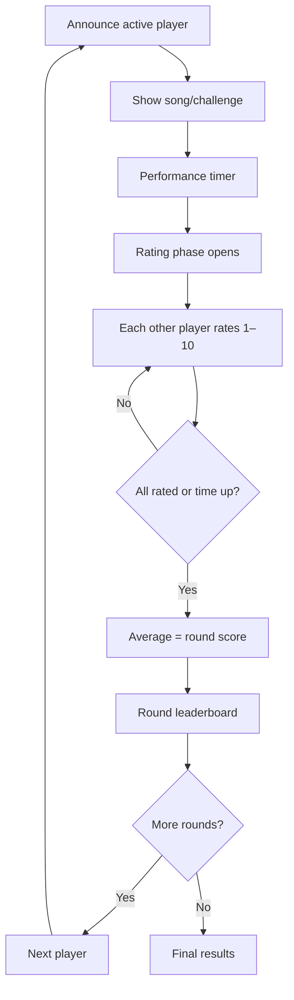
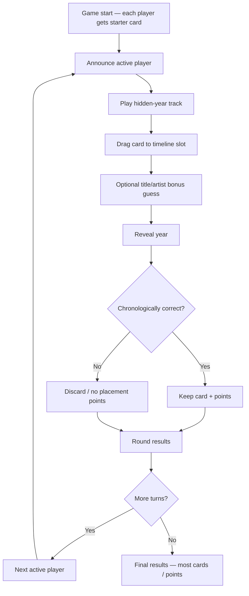

# Spot the Song — Screen Flow

Navigation and game flows. See [`PRODUCT_CANVAS.md`](./PRODUCT_CANVAS.md) for screen details.

---

## App navigation (static routes)

**Dev route (Phase 8a):** `/dev/spotify` — connect Spotify, paste track URI, play first 15s/30s. Not part of the main game flow until Phase 8b.

---

## Create game flow

---

## Join game flow

---

## All In flow

---

## Turn Guess flow

---

## Sing Along flow

---

## Timeline flow

---

## Socket-driven phase overlay

Game screens (`/room/:code/play`) render different UI based on `room.status` and `currentRound.phase` from `server:room-state` / `server:phase-changed`. See [`STATE_MACHINE.md`](./STATE_MACHINE.md).
