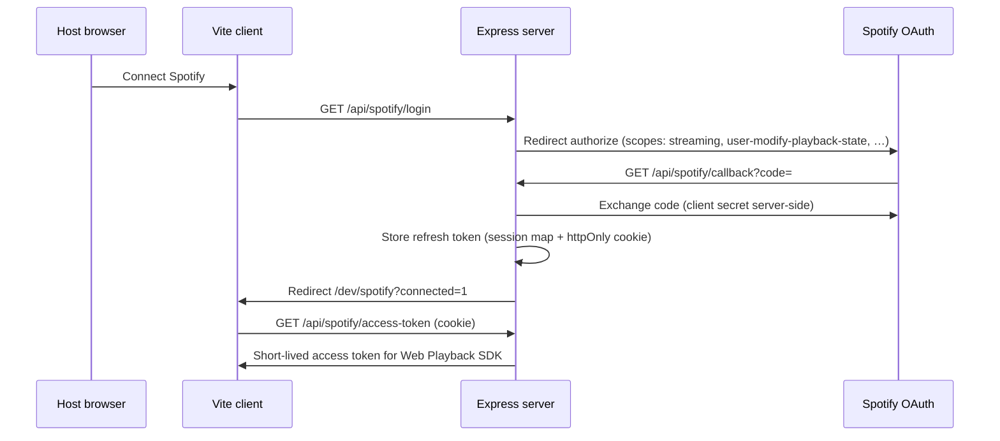

# Spotify Architecture — Spot the Song

Host-only full-track playback via Spotify Web Playback SDK. The game engine stays independent of Spotify.

---

## 1. Principles

| Layer | Responsibility |
|-------|------------------|
| **Spotify** | Music playback (full tracks, host browser) |
| **Spot the Song** | Track selection, round timing, answers, voting, scoring, reveal |
| **Catalog** | Import playlist/album metadata (server) |
| **Playback** | Play URI from 0ms for N ms (host client only) |

`preview_url` is **deprecated** for gameplay — optional legacy fallback only.

---

## 2. Authentication flow



**Security**

- `SPOTIFY_CLIENT_SECRET` never sent to the browser
- Refresh tokens stored server-side (in-memory for dev; persistent store later)
- Access tokens returned only to authenticated cookie session
- No tokens over game socket

**Env (see `server/.env.example`)**

- `SPOTIFY_CLIENT_ID`
- `SPOTIFY_CLIENT_SECRET`
- `SPOTIFY_REDIRECT_URI` (default `http://localhost:3001/api/spotify/callback`)

Register the redirect URI in the [Spotify Developer Dashboard](https://developer.spotify.com/dashboard).

**Premium note:** Web Playback SDK typically requires Spotify Premium. UI surfaces this; we do not fake playback if the SDK refuses.

---

## 3. Catalog provider

**Interface:** `MusicCatalogProvider` (`shared/src/music/catalog.ts`)

```ts
interface MusicCatalogProvider {
  getTracksFromPlaylist(url: string): Promise<Track[]>
  getTracksFromAlbum(url: string): Promise<Track[]>
}
```

**Implementation:** `server/src/music/SpotifyCatalogProvider.ts`

- Reuses embed scrape + Web API import from `spotifyImport.ts`
- Maps to canonical `Track` with `spotifyUri`, `spotifyUrl`, `durationMs`
- Dedupes by Spotify id + normalized title/artist
- Does **not** require `previewUrl` for room creation

**Server credentials:** Client-credentials flow still used for album API fallback during import. Separate from host OAuth used for playback.

---

## 4. Playback provider

**Interface:** `PlaybackProvider` (`shared/src/music/playback.ts`)

Host-only client implementation: `client/src/lib/spotify/SpotifyPlaybackService.ts`

- Loads `https://sdk.scdn.co/spotify-player.js`
- `getOAuthToken` → `GET /api/spotify/access-token`
- On ready: stores `device_id`
- `playTrack({ uri, startMs, durationMs })` → Spotify Web API `PUT /me/player/play`
- Local timer pauses after `durationMs` (safety fallback)
- **Authoritative round timing remains on the server** (future socket events)

---

## 5. Host-only playback model

| Role | Audio | Sees before reveal |
|------|-------|-------------------|
| **Host** | Web Playback SDK | Spotify URI only (for playback command) |
| **Guests** | None (listen to host speaker) | Timer + “Listen…” — no title/artist/album/year/URL |

After reveal, all players receive full metadata + **Open in Spotify** link.

---

## 6. Server / client responsibilities

### Server

- Import catalog (playlist/album URLs)
- Pick random track each round (full `Track` in runtime only)
- Authoritative round timer (`endsAt`)
- Score answers; emit reveal payload
- Host OAuth token exchange + refresh
- Validate host-only playback acks (future)

### Host client

- Connect Spotify before starting game (future setup gate)
- Initialize Web Playback SDK
- Execute `playTrack` when server commands (future)
- Pause on `round:clip-ended` (future)
- Report `spotify:player-ready`, `spotify:playback-started`, `spotify:playback-error`

### Guest clients

- Show countdown / “Listen…”
- Never receive answer metadata before reveal

---

## 7. WebSocket events (planned — Phase 8)

Defined in `shared/src/socket/spotifyEvents.ts`:

| Direction | Event | Payload |
|-----------|-------|---------|
| S→host | `server:spotify-play-track` | `{ spotifyUri, startMs, durationMs, roundIndex }` |
| S→room | `server:round-started` | timer, clip duration — **no answer fields** |
| S→room | `server:round-clip-ended` | `{ roundIndex }` |
| S→room | `server:round-answering` | `{ roundIndex, endsAt }` |
| S→room | `server:round-reveal` | full track + `spotifyUrl` |
| H→S | `client:spotify-player-ready` | `{ deviceId }` |
| H→S | `client:spotify-playback-started` | `{ roundIndex, spotifyUri }` |
| H→S | `client:spotify-playback-error` | `{ message, code? }` |

Not wired into multiplayer until Phase 8 integration (after `/dev/spotify` test passes).

---

## 8. Track metadata privacy

**Before reveal**

- Guests: `RoundTrackPublic` should expose at most opaque `trackId` (future tightening)
- Host: receives playback command with URI only
- No `spotifyUrl`, title, artist, album, year in room broadcasts

**After reveal**

- `server:round-reveal` / `server:round-results` includes full metadata
- UI shows **[ Open in Spotify ↗ ]** using `spotifyUrl`

---

## 9. Clip settings

```ts
type ClipSettings = {
  mode: 'start' | 'random'  // MVP: 'start' only
  durationMs: number        // 15000 | 30000
}
```

Setup UI (future): 15s / 30s radio. Random segment mode deferred.

---

## 10. Error handling

| Error | UX |
|-------|-----|
| Host not authenticated | Connect Spotify CTA |
| Token expired | Reconnect button; server refresh or re-login |
| SDK unavailable | Sketch error + retry |
| Player not ready | Initialize player / wait |
| Playback transfer fails | Try again + Open in Spotify |
| Empty playlist | Clear error at setup |
| Invalid URL | Validation message |
| Host disconnect | Promote host; pause round (existing Phase 7) |
| API rate limit | Retry path; do not crash room |

If playback cannot start, **pause the round** rather than silently continuing.

---

## 11. Dev test route

**`/dev/spotify`** — standalone playback test (Phase 8a)

1. Connect Spotify
2. Initialize player
3. Paste track URL/URI
4. Play first 15s or 30s from 0:00
5. Auto-pause at clip end; manual Pause

Do not wire multiplayer until this screen works reliably.

---

## 12. Future: random clip mode

When `ClipSettings.mode === 'random'`:

- Server picks `startMs` within `[0, durationMs - clipDurationMs]`
- Host plays from that offset
- Same privacy rules apply

---

## File map

| Path | Purpose |
|------|---------|
| `shared/src/types/track.ts` | Canonical `Track` |
| `shared/src/types/clip.ts` | `ClipSettings` |
| `shared/src/music/catalog.ts` | Catalog interface |
| `shared/src/music/playback.ts` | Playback interface |
| `shared/src/socket/spotifyEvents.ts` | Planned socket payloads |
| `server/src/music/SpotifyCatalogProvider.ts` | Catalog implementation |
| `server/src/spotify/*` | OAuth + session store |
| `server/src/routes/spotifyAuth.ts` | Auth HTTP routes |
| `client/src/lib/spotify/SpotifyPlaybackService.ts` | Web Playback SDK wrapper |
| `client/src/pages/DevSpotifyPage.tsx` | Dev test UI |
