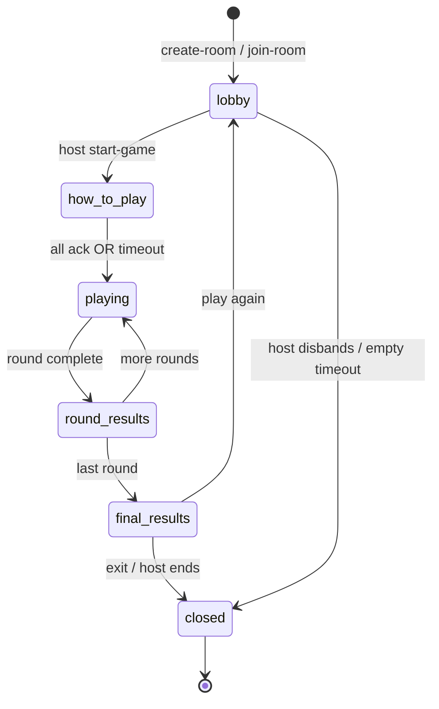
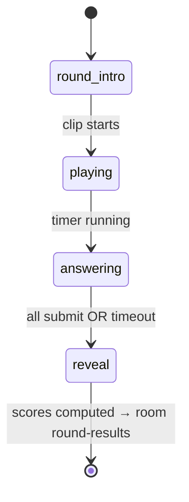
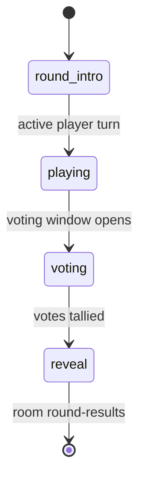
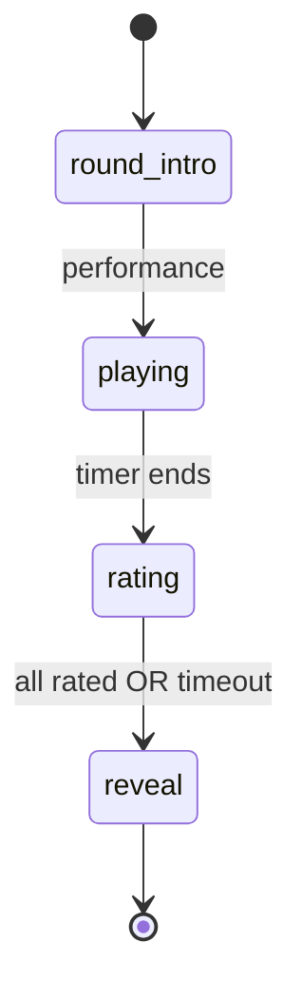
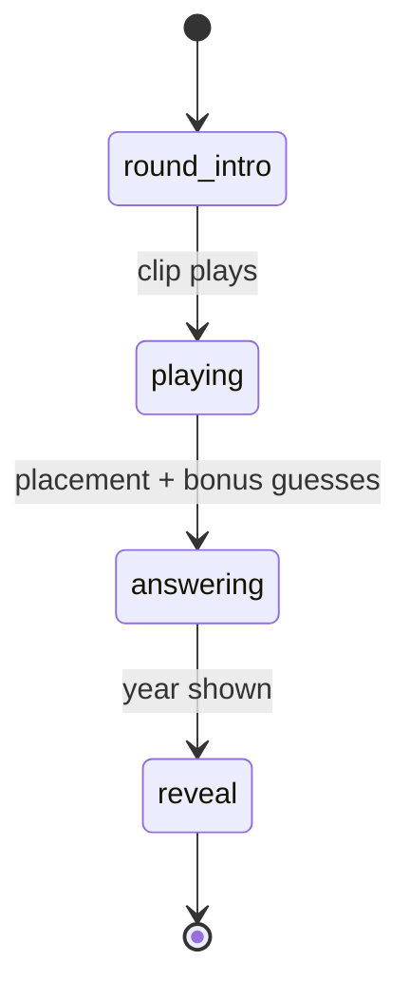

# Spot the Song — State Machine

Server-authoritative room and round phases. Clients render UI from `GameRoom.status` and `CurrentRound.phase`.

---

## Room-level status (`RoomStatus`)

```ts
type RoomStatus =
  | 'lobby'
  | 'how-to-play'
  | 'playing'
  | 'round-results'
  | 'final-results'
  | 'closed'
```

### Transitions



| From | Event | To | Notes |
|------|-------|-----|-------|
| — | `create-room` | `lobby` | Host is first player |
| `lobby` | `start-game` | `how-to-play` | Host only |
| `how-to-play` | all ready / skip timer | `playing` | Mode-specific round begins |
| `playing` | round scored | `round-results` | Brief results beat |
| `round-results` | `next-round` | `playing` | If rounds remain |
| `round-results` | last round done | `final-results` | |
| `final-results` | `play-again` | `lobby` | Reset round index, keep players |
| `*` | `close-room` | `closed` | Cleanup memory |

---

## Round-level phase (`RoundPhase`)

Used while `room.status === 'playing'`.

```ts
type RoundPhase =
  | 'round-intro'
  | 'playing'
  | 'answering'
  | 'voting'
  | 'rating'
  | 'reveal'
```

Not every phase applies to every mode (see matrix below).

### All In phases



| Phase | Client UI |
|-------|-----------|
| `round-intro` | “Get ready…” + track artwork sketch |
| `playing` | Audio player + countdown |
| `answering` | One input per enabled guess field + Submit |
| `reveal` | Correct answers + points breakdown |

_All In collapses `playing` and `answering` — timer runs while inputs are open._

---

### Turn Guess phases



| Phase | Active player | Other players |
|-------|---------------|---------------|
| `round-intro` | “Your turn!” | “Listen…” |
| `playing` | Prompt checklist, timer | Waiting |
| `voting` | Waiting (cannot vote) | YES/NO per field |
| `reveal` | Results | Results |

---

### Sing Along phases



| Phase | Active player | Others |
|-------|---------------|--------|
| `playing` | Song display + “Sing!” | Listening |
| `rating` | Waiting | 1–10 slider/buttons |
| `reveal` | Average score shown | Average shown |

---

### Timeline phases



| Phase | UI |
|-------|-----|
| `playing` | Hidden-year card + audio |
| `answering` | Draggable placement + optional title/artist |
| `reveal` | Year flip + timeline validation animation |

---

## Phase applicability matrix

| RoundPhase | All In | Turn Guess | Sing Along | Timeline |
|------------|:------:|:----------:|:----------:|:--------:|
| `round-intro` | ✓ | ✓ | ✓ | ✓ |
| `playing` | ✓ | ✓ | ✓ | ✓ |
| `answering` | ✓ | — | — | ✓ |
| `voting` | — | ✓ | — | — |
| `rating` | — | — | ✓ | — |
| `reveal` | ✓ | ✓ | ✓ | ✓ |

---

## Timer ownership

All timers start on the **server** with `endsAt` epoch ms broadcast in room state. Clients display countdown derived from `endsAt - Date.now()`.

Never trust client-reported time for scoring (speed bonus uses server receive timestamp vs round start).

---

## Player roles during phases

| Role | Definition |
|------|------------|
| Host | Can start game, update pre-start settings, play again |
| Active player | Current turn in Turns modes; cannot vote on self |
| Participant | Everyone else |

`activePlayerId` is null in All In mode.

---

## Reconnection (Phase 7)

On reconnect with same `playerId` + session token:

1. Server re-attaches socket to existing player.
2. Full `server:room-state` snapshot sent.
3. If mid-`answering`, restore partial answers if any (All In).
4. If disconnected too long mid-round, mark as skipped for that round.

Phase 0–1: basic reconnect in lobby only.

---

## Implementation location

| Concern | Path |
|---------|------|
| Status enums | `shared/src/types/game.ts` |
| Transition logic | `server/src/game/RoomManager.ts` (Phase 1+) |
| Phase handlers | `server/src/game/modes/*.ts` (Phase 2+) |
